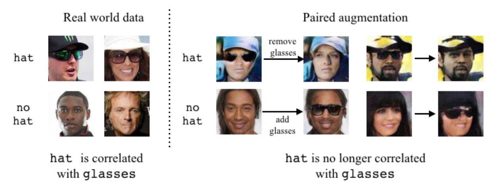
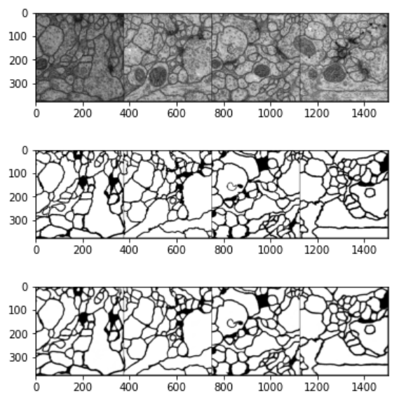
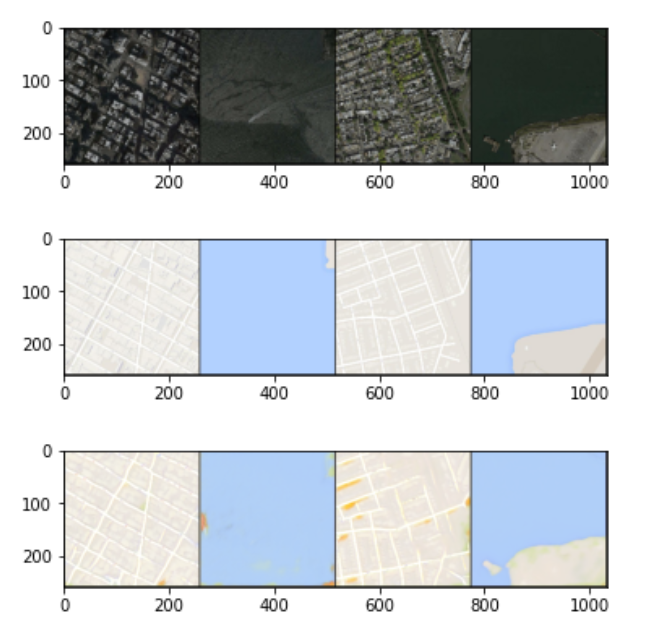

# gan-specialization-coursera
 Coursera specialization in Generative Adversarial Networks (GANs) by deeplearning.ai

## Summary 

### Building GANs

### Bias

Here are three ways that are computationally useful and widely referenced. They are, by no means, the only definitions of fairness (see more details here):

    Demographic parity: the overall distribution of the predictions made by a predictor is the same for different values of a protected class.
    Equality of odds: all else being equal, the probability that you predict correctly or incorrectly is the same for different values of a protected class.
    Equality of opportunity: all else being equal, the probability that you predict correctly is the same for different valus of a protected class (weaker than equality of odds).

 ## Courses

The GANs Specialization is offered by deeplearning.ai on Coursera. The courses are taught by:
* Sharon Zhou, Instructor  
* Eda Zhou, Curriculum Developer
* Eric Zelikman, Curriculum Engineer
contains three courses:

1. [Course 1: Build Basic Generative Adversarial Networks](https://www.coursera.org/learn/build-basic-generative-adversarial-networks-gans)

2. [Course 2: Build Better Generative Adversarial Networks](https://www.coursera.org/learn/build-better-generative-adversarial-networks-gans)

3. [Course 3: Apply Generative Adversarial Networks (GANs)](https://www.coursera.org/learn/apply-generative-adversarial-networks-gans)

# [Course 1: Build Basic Generative Adversarial Networks](https://www.coursera.org/learn/build-basic-generative-adversarial-networks-gans)

## Week 1: Intro to GANs
See some real-world applications of GANs, learn about their fundamental components, and build your very own GAN using PyTorch!

### Graded notebook: Your First GAN
### Goal
Build and train a GAN that can generate hand-written images of digits (0-9) using PyTorch ([documentation](https://pytorch.org/docs/stable/index.html)).

### Learning Objectives
1.   Build the generator and discriminator components of a GAN from scratch.
2.   Create generator and discriminator loss functions.
3.   Train your GAN and visualize the generated images.

## Week 2: Deep Convolutional GANs
Learn about different activation functions, batch normalization, and transposed convolutions to tune your GAN architecture and apply them to build an advanced DCGAN specifically for processing images!

### Graded notebook: Deep Convolutional GAN (DCGAN)

### Goal
Build and train a Deep Convolutional GAN (DCGAN), influential type of GAN model developed in 2015, using the MNIST dataset.

*Reference: [here](https://arxiv.org/pdf/1511.06434v1.pdf) 

### Learning Objectives
1.   Get hands-on experience making a widely used GAN: Deep Convolutional GAN (DCGAN).
2.   Train a powerful generative model.

Figure: Architectural drawing of a generator from DCGAN from [Radford et al (2016)](https://arxiv.org/pdf/1511.06434v1.pdf).

## Week 3: Wasserstein GANs with Gradient Penalty
Learn advanced techniques to reduce instances of GAN failure due to imbalances between the generator and discriminator! Implement a WGAN to mitigate unstable training and mode collapse using W-Loss and Lipschitz Continuity enforcement.

### Graded notebook: WGAN

### Goals
Build a Wasserstein GAN with Gradient Penalty (WGAN-GP) that solves some of the stability issues with the GANs. Specifically, use a special kind of loss function known as the W-loss, where W stands for Wasserstein, and gradient penalties to prevent mode collapse.

### Learning Objectives
1.   Get hands-on experience building a more stable GAN: Wasserstein GAN with Gradient Penalty (WGAN-GP).
2.   Train the more advanced WGAN-GP model.

## Week 4: Conditional GAN & Controllable Generation
Understand how to effectively control your GAN, modify the features in a generated image, and build conditional GANs capable of generating examples from determined categories!

### Graded notebook: Conditional GAN

### Goals
Make a conditional GAN in order to generate hand-written images of digits, conditioned on the digit to be generated (the class vector). This let you choose what digit you want to generate.

### Learning Objectives
1.   Learn the technical difference between a conditional and unconditional GAN.
2.   Understand the distinction between the class and noise vector in a conditional GAN.

### Graded notebook: Controllable Generation

### Goals
Implement a GAN controllability method using gradients from a classifier. By training a classifier to recognize a relevant feature, you can use it to change the generator's inputs (z-vectors) to make it generate images with more or less of that feature.

### Learning Objectives
1. Observe how controllability can change a generator's output.
2. Resolve some of the challenges that entangled features pose to controllability.

# [Course 2: Build Better Generative Adversarial Networks](https://www.coursera.org/learn/build-better-generative-adversarial-networks-gans)

 ## Week 1: Evaluation of GANs
Understand the challenges of evaluating GANs, learn about the advantages and disadvantages of different GAN performance measures, and implement the Fréchet Inception Distance (FID) method using embeddings to assess the accuracy of GANs!

### Graded notebook: Fréchet Inception Distance

### Goals
Gain a better understanding of some of the challenges that come with evaluating GANs and a response you can take to alleviate some of them called Fréchet Inception Distance (FID).

### Learning Objectives
1.   Understand the challenges associated with evaluating GANs.
2.   Write code to evaluate the Fréchet Inception Distance.

## Week 2: GAN Disadvantages and Bias
Learn the disadvantages of GANs when compared to other generative models, discover the pros/cons of these models—plus, learn about the many places where bias in machine learning can come from, why it’s important, and an approach to identify it in GANs!

### Quiz: Analyzing Bias

### Graded notebook: Bias
### Goals
Explore a way to identify some biases of a GAN using a classifier, in a way that's well-suited for attempting to make a model independent of an input. Note that not all biases are as obvious as the ones you will see here.

### Learning Objectives
1.  Be able to distinguish a few different kinds of bias in terms of demographic parity, equality of odds, and equality of opportunity (as proposed [here](http://m-mitchell.com/papers/Adversarial_Bias_Mitigation.pdf)).
2. Be able to use a classifier to try and detect biases in a GAN by analyzing the generator's implicit associations.

### Optional notebook: Neural Radiance Fields (NeRF)

### Goals

In this notebook, it's explained how to use Neural Radiance Fields to generate new views of a complex 3D scene using only a couple input views, first proposed by [NeRF: Representing Scenes as Neural Radiance Fields for View Synthesis](https://arxiv.org/abs/2003.08934) (Mildenhall et al. 2020). Though 2D GANs have seen success in high-resolution image synthesis, NeRF has quickly become a popular technique to enable high-resolution 3D-aware GANs.

Image Credit: [Matthew Tancik](https://www.matthewtancik.com/nerf) 

### Overview

NeRF is an approach for **novel view synthesis**, where given some input images of a scene and cooresponding camera poses, we want to generate new images of the same scene from arbitrary camera poses. Because training a full NeRF can take hours to days, it's used a feature-limited tiny NeRF ([official GitHub](https://colab.research.google.com/github/bmild/nerf/blob/master/tiny_nerf.ipynb)) to train faster, while highlighting the major differences.

## Optional notebook: Using GANs to augment and de-bias datasets
### Goals

Fairness in visual recognition is becoming a prominent and critical topic of discussion as recognition systems are deployed at scale in the real world. Models trained from data in which target labels are correlated with protected attributes (i.e. gender, race) are known to learn and perpetuate those correlations. 

Learn about *Fair Attribute Classification through Latent Space De-biasing* (Ramaswamy et al. 2020) that introduces a method for training accurate target classifiers while mitigating biases that stem from these correlations. 

## Problem

Suppose you want to train a visual recognition model that recognizes the presence of an attribute, such as **wearing a hat**. However, in the real world, wearing a hat can be correlated with **wearing glasses**, for example, because people often wear both hats and sunglasses outside and take them off inside. This correlation may be reflected in the training data, and a classifier trained to recognize a hat may rely on the presence of glasses. Consequently, the classifier may fail to recognize a hat in the absence of glasses, and vice versa.

## Week 3: StyleGAN and Advancements
Learn how StyleGAN improves upon previous models and implement the components and the techniques associated with StyleGAN, currently the most state-of-the-art GAN with powerful capabilities!

## Graded notebook: Components of StyleGAN
### Goals
Implement various components of StyleGAN, including the truncation trick, the mapping layer, noise injection, adaptive instance normalization (AdaIN), and progressive growing. 

### Learning Objectives

1.   Understand the components of StyleGAN that differ from the traditional GAN.
2.   Implement the components of StyleGAN.

# [Course 3: Apply Generative Adversarial Networks (GANs)](https://www.coursera.org/learn/apply-generative-adversarial-networks-gans)

## Week 1: GANs for Data Augmentation and Privacy
Learn different applications of GANs, understand the pros/cons of using them for data augmentation, and see how they can improve downstream AI models!

## Graded notebook: Data Augmentation
### Goals
Build a generator that can be used to help create data to train a classifier. Some relevant papers:

-   With smaller datasets, GANs can provide useful data augmentation that substantially [improve classifier performance](https://arxiv.org/abs/1711.04340). 
-   You have one type of data already labeled and would like to make predictions on [another related dataset for which you have no labels](https://www.nature.com/articles/s41598-019-52737-x). (You'll learn about the techniques for this use case in future notebooks!)
-   You want to protect the privacy of the people who provided their information so you can provide access to a [generator instead of real data](https://www.ahajournals.org/doi/full/10.1161/CIRCOUTCOMES.118.005122). 
-   You have [input data with many missing values](https://arxiv.org/abs/1806.02920), where the input dimensions are correlated and you would like to train a model on complete inputs. 
-   You would like to be able to identify a real-world abnormal feature in an image [for the purpose of diagnosis](https://link.springer.com/chapter/10.1007/978-3-030-00946-5_11), but have limited access to real examples of the condition. 

### Learning Objectives
1.   Understand some use cases for data augmentation and why GANs suit this task.
2.   Implement a classifier that takes a mixed dataset of reals/fakes and analyze its accuracy.

## Week 2: Image-to-Image Translation with Pix2Pix
Understand image-to-image translation, learn about different applications of this framework, and implement a U-Net generator and Pix2Pix, a paired image-to-image translation GAN!

## Graded notebook: U-Net

### Goals
Implement a U-Net for a biomedical imaging segmentation task labeling neurons. The dataset of electron microscopy images and segmentation data. The information about the dataset you'll be using can be found [here](https://www.ini.uzh.ch/~acardona/data.html)! 

> Arganda-Carreras et al. "Crowdsourcing the creation of image
segmentation algorithms for connectomics". Front. Neuroanat. 2015. https://www.frontiersin.org/articles/10.3389/fnana.2015.00142/full
### Learning Objectives
1.   Implement your own U-Net.
2.   Observe your U-Net's performance on a challenging segmentation task.

### U-Net Architecture
Images are first fed through many convolutional layers which reduce height and width while increasing the channels, which the authors refer to as the "contracting path." For example, a set of two 2 x 2 convolutions with a stride of 2, will take a 1 x 28 x 28 (channels, height, width) grayscale image and result in a 2 x 14 x 14 representation. The "expanding path" does the opposite, gradually growing the image with fewer and fewer channels.
The figure below is from the paper, [*U-Net: Convolutional Networks for Biomedical Image Segmentation*](https://arxiv.org/abs/1505.04597), by Ronneberger et al. 2015. It shows the U-Net architecture and how it contracts and then expands.

The trained U-Net is able to segment the neurons from the electron microscopy image. The first row are the input images, the second row the ground truth labels, and the third row the predictions.

## Graded notebook: Pix2Pix

### Goals
Write a generative model based on the paper [*Image-to-Image Translation with Conditional Adversarial Networks*](https://arxiv.org/abs/1611.07004) by Isola et al. 2017, also known as Pix2Pix.

Train a model that can convert aerial satellite imagery ("input") into map routes ("output"), as was done in the original paper. The emphasis of the assignment will be on the loss function.

### Learning Objectives
1.   Implement the loss of a Pix2Pix model that differentiates it from a supervised U-Net.
2.   Observe the change in generator priorities as the Pix2Pix generator trains, changing its emphasis from reconstruction to realism.

Example of the predictions of the pix2pix trained model. In the first row are the input satellite images, the second row are the labeled map routes, and the third row are the predictions.

## Week 3: Unpaired Translation with CycleGAN
Understand how unpaired image-to-image translation differs from paired translation, learn how CycleGAN implements this model using two GANs, and implement a CycleGAN to transform between horses and zebras!
## Graded notebook: CycleGAN

### Goals
Write a generative model based on the paper [*Unpaired Image-to-Image Translation
using Cycle-Consistent Adversarial Networks*](https://arxiv.org/abs/1703.10593) by Zhu et al. 2017, commonly referred to as CycleGAN.

Train a model that can convert horses into zebras, and vice versa (images from: https://github.com/togheppi/CycleGAN)

### Learning Objectives
1.   Implement the loss functions of a CycleGAN model.
2.   Observe the two GANs used in CycleGAN.